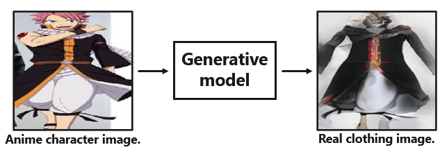

# Anime2Clothing
[](https://arxiv.org/abs/2008.11479) [](https://colab.research.google.com/github/tan5o/anime2clothing/blob/master/Anime2Clothing_DEMO.ipynb)



Pytorch official implementation of **Anime to Real Clothing: Cosplay Costume Generation via Image-to-Image Translation**.
 (https://arxiv.org/abs/2008.11479)

## Prerequisites
- Anaconda 3
- Python 3
- CPU or NVIDIA GPU + CUDA CuDNN

## Getting Started
### Training
`python train.py --project_name cosplay_synthesis  --dataset DATASET`

#### Training dataset structure
```buildoutcfg
DATASET
├── train
│    ├── a
│    │   ├── 0.png
│    │   ├── 1.png
│    │      ︙
│    |   └── n.png
│    └── b
│        ├── 0.png
│        ├── 1.png
│           ︙
│        └── n.png
└── test
     ├── a
     │   ├── 0.png
     │   ├── 1.png
     │      ︙
     |   └── n.png
     └── b
         ├── 0.png
         ├── 1.png
            ︙
         └── n.png
```

#### Continue Training 
Add continue_train otpion, and you can control starting epoch and resolution.
Basically, model load from latest checkpoints. However, you can chose number of epoch if you use `--load_epoch` option.

`--continue_train --start_epoch 47  --start_resolution 256`

### Testing
`python test.py --model_path models/pretrained_model.pth --input_dir dataset/test/a --output_dir result`

### Pre-trained model
You can download [**pre-trained model**](models/pretrained_unet_20200122.pth) from `models/pretrained_unet_20200122.pth`

We recommend using an anime character image with a simple background as the input image.
## Acknowledgments
Our code is inspired by [pix2pix](https://github.com/junyanz/pytorch-CycleGAN-and-pix2pix) and [pix2pixHD](https://github.com/NVIDIA/pix2pixHD)
